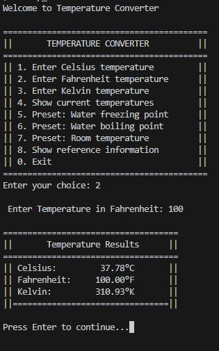

# Project Name: Temperature Converter

The program creates a temperature converter that can convert any value in Celcius, Kelvin or Farenheit to the other two.
This Program also develops a custom command line GUI using which the user can interact with the script.

## Features

- Convert between Celsius, Fahrenheit, and Kelvin
- Real-time conversion display
- Preset temperature values (freezing, boiling, room temperature)
- Input validation
- Reference temperature information

## Build and Run

### Using CMake
```bash
mkdir build && cd build
cmake ..                  // Do this within the build folder
make
make run
```

### Using g++ directly
```bash
g++ -std=c++17 -O2 -Wall -o temp_converter main.cpp TemperatureConverter.cpp
./temp_converter
```

## Usage

Run the program and select from the menu:
- Enter temperatures in any scale
- View conversions in all three scales
- Use preset values for common temperatures

## Output

The program is output is demonstrated here:

<p>
    
    <figcaption>Temperature Converter Output</figcaption>
</p>

## Requirements

- C++17 compatible compiler
- CMake 3.10+ (optional)

## License

This project is licensed under the GNU General Public License, Version 3 - see the [LICENSE.md](../LICENSE.md) file for details.

## Contact

- Author: Ujval Madhu
- Email: ujvalmadhu003@gmail.com

## Acknowledgments

- This Project was done as part of a project using instructions from Cadence Design Systems, Online Support Courses